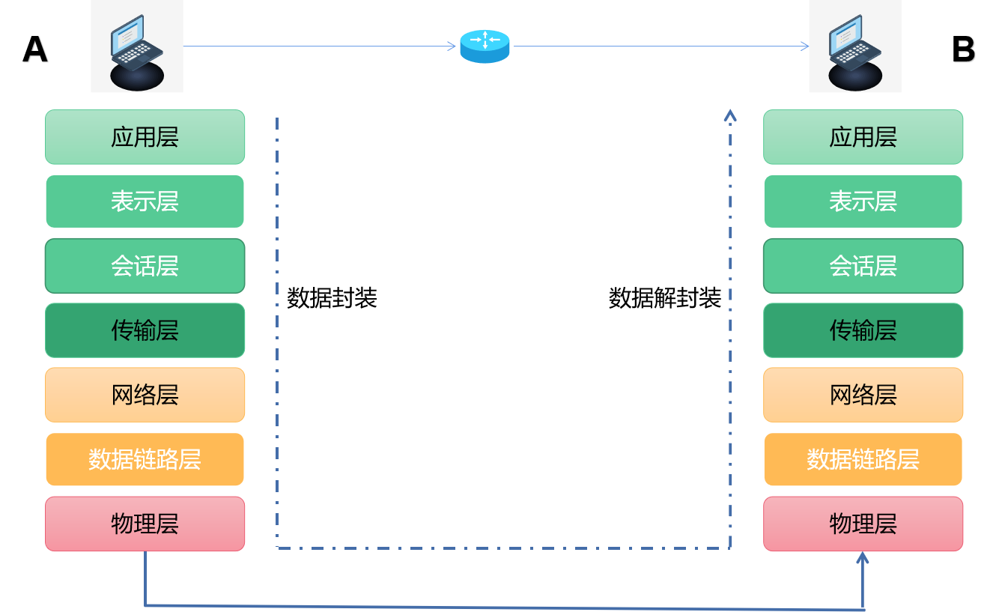

# 湾大引航计划选课系统开发指南

*温馨提示：在阅读本开发文档之前，你需要具备的知识：前端的基础知识（HTML + CSS +  Js）、Python的基础知识（面向对象编程必须过关）、Django基础知识、数据库的基本知识（关系型数据库与非关系型数据库），否则你可能会看的有些吃力。你可能没有办法看懂项目里的每行代码，但是你完全可以学习每个功能的实现思路和代码逻辑。*

---

## 开发指南简介

* 开发知识点：该指南会从该网站前端（20%）和后端（80%）进行展开讲解。前端只会介绍Js部分。后端基本都会介绍。
* 看完你将得到的收获：整个网站开发的基本流程（开发 + 部署）、Python高级基础知识巩固、Django开发流程。

## 项目简介

项目设计之初是为了简化排课的工作。在众多学生中，学生的课表层出不穷，人工进行排课的难度可想而知。因此以课程为常量，让学生自己在系统选择合适的时间段进行上课，这样就把课程冲突的问题交给学生自己处理，老师只需要拿到选课的名单即可。这样可以极大程度上降低了排课的工作量。

## 项目优势

* 用户层面：界面简洁，操作简单，容易上手。对小白较友好。
* 开发者层面：项目模块较少，轻量级架构。适合中等偏下级别的程序员开发。

## 项目主要技术

* 项目级别：小型Web项目。
* 开发模式：前后端不分离。
* 前端板块：Vue（渐进式）+ ElementUI（极速开发Web界面）。
* 后端板块：Django（大而全的Python重量级后端开发框架）。
* 数据库：Mysql + Redis。
* 部署方式：Django + uWSGI + Nginx（单机部署方式）。

*由于是个人开发并且是急需，所以优先选择了前后端不分离的开发模式，该开发模式对于个人开发而言，是比较快速的开发模式（整个项目的开发周期只用了5天左右）。*

## 网络编程基础知识

在开始之前，你还需要了解一些与网络相关的知识。当然，如果你已经学过了计算机网络原理、网络编程、操作系统或者你已经很熟悉了网络知识，那么你可以跳过该篇幅。

*下面的东西只能够给你一个刻板印象，如果真正的要学习这些东西，你需要去看对应的书籍或者视频。*

+ ### HTTP

  英文名称：Hypertext Transfer Protocol，即超文本传输协议，它是一个简单的请求-响应协议。超文本，即超出文本的内容，也就是说，在网页上不仅能显示普通的文本内容，还能显示图片、视频等媒体文件。现在你所访问的网址，都遵循了该协议，所以现在的网页才能够如此丰富多彩。

  那么如何理解这个协议呢？比如中国人与中国人之间，需要使用中文进行交流，那么中文就可以认为是他们之间交流的一种协议。只有在双方都遵循了该协议下，才能够正常的进行交流。网络之间的通信亦是如此。

  本项目使用的就是http协议。

+ ### HTTPS

  即HTTP的加密传输方式，当HTTP携带了SSL证书以后，该传输协议就会变成HTTPS，在数据传输的时候就会将数据进行加密，以确保数据的安全性。

  当你打开一个网址的时候，将目光移至网址栏中，你就可以看到：

  

+ ### HTTP方法

  HTTP方法又叫HTTP行为，通常包括以下几个方法：

  * GET：从数据库中获取数据。
  * POST：向数据库中新增数据。
  * PUT：修改数据库中的数据。
  * DELETE：删除数据库中的数据。

  一般而言，我们打开一个网页用的是GET方法，登录或注册的时候使用的是POST方法。此外，本项目中还支持修改用户信息，使用的是PUT方法。而退课功能使用的是DELETE方法。

  浏览器默认发起请求的方法是GET，请求方法可以由前端向后端发送请求时由前端决定。

  此外还有其他的HTTP方法，例如PATCH等，这里就不一一介绍了。

+ ### IP地址

  为了能使每个设备都能够在英特网中被找到，每台设备都会有一个唯一的IP地址，并且在已经联网的情况下，网络会自动的为该设备分配一个唯一的IP。就像邮箱一样，每个邮箱都是唯一的，这样发送的邮件才能够精准无误。同样唯一的IP就保证了数据传输的准确性。

+ ### 端口号

  当有了IP还是无法完成精确的定位。比如现在电脑上存在两个聊天软件，一个是微信，一个是QQ。假如你的好朋友通过微信发了一条信息给你，这条信息顺着网线和IP找到了你的设备。但是问题又来了，这条信息到底是发送到微信还是QQ呢？

  为了解决这个问题，就有了端口号的概念。

  现在，我给微信和QQ分发一个唯一的端口，分别是1和2。那么微信和QQ使用的端口号永远都是1和2。这样一来，你的好朋友通过微信发送的信息，会通过1号端口将信息发送出去，同理你的设备也会监听1号端口，如果有数据，那么就接收。

  综上所述，IP就是在对应的网段中找到相应的设备，通过端口号来定位到对应的应用。这样的话，数据就能够被准确的完成发送与接收的工作了。

  比如你的宿舍号是405，那么你应该知道，你会先在该楼层中找到4楼，这里可以理解为IP地址。之后你再找到编号05的宿舍，这里你可以理解成端口号。

  标准的IP地址应该是：IP:端口号，比如222.217.92.65:443。

+ ### 域名

  虽然有了IP和端口号可以将数据完成精准的发送与接收，但是有一个缺点就是：难记。就比如说：222.217.92.65:443，这个IP和端口号。我相信应该没有人能说出它是什么网站吧。但是我告诉你它就是京东的官网（你不能通过该IP访问京东，因为京东限制了直接通过IP访问网站的方式）。

  所以为了解决难记的问题，就有了域名这个概念。

  其中www.jd.com就是222.217.92.65:443对应的域名，你可以通过域名直接访问这个IP。

+ ### 域名解析与反解析

  那么这时就有人会问了，为什么域名能直接绑定IP呢？这就得益于有个东西叫做DNS服务器。它是用来干嘛的呢？

  当你通过输入域名访问网站的时候，此时不会直接将请求发送到服务器中，而是先通过DNS服务器将该域名反解析为IP+端口的形式，再将请求发送给对应的Web服务器中。因此域名就包括了IP + 端口。 

  

  所以域名反解析是表示从域名到IP的转换，域名解析就是表示从IP到域名的转换。

+ ### URL

  英文名称：Uniform Resource Locator，即统一资源定位符。换句话说，你在浏览器中输入的网址可以近似的理解为URL，注意是近似而不是完全。

  URL的四大组成部分：请求协议 + 主机名/域名 + 端口号 + 请求资源路径。

  以京东的URL为例子：https://www.jd.com/computer?id=1&price=999.9。

  我们把该网址进行拆分：https + www.jd.com + computer?id=1&price=999.9。

  第一部分的https表示该网站的请求协议。属于加密协议。

  第二部分的www.jd.com表示该网址主机名或者说是域名，该域名就包含了端口号，所以只拆分成了3个部分。

  第三部分的computer?id=1&price=999.9，表示访问该网站对应的服务器的资源路径。‘？’后表示的是参数部分。‘&’是每个参数的分隔符。

+ ### 当你在浏览器的网址栏中输入网址，并按下回车时，到底发生了什么？

  当你输入URL并按下回车的那一刻，经过几秒钟的响应时间就可以看到一个完整的页面。那么其实在底层经过了很多步骤，才会显示出你眼前的网页。

  首先你要知道网络是分层的，也就是说，网络分为很多层，每一层都会将数据处理成对应的形式并传输到另一层。

  从最底层开始，网络可以看成是这7层：物理层、数据链路层、网络层、传输层、会话层、表示层、应用层。这7层又叫OSI七层模型。

  那么从一台设备到另一台设备数据传输的过程如下图：

  

  我们在浏览上的操作都是在应用层完成，之后由应用层自上而下逐步完成数据的封装，最后通过物理层（网线）找到另一台设备，并从物理层自下而上的顺序逐步完成数据的解封，传输到另一台设备的应用层。

  我们在浏览器地址栏中按下回车的那一刻，客户端（浏览器）就会向服务端（服务器）发起一个http请求（request），这个请求最终会到达网站的服务端，服务端会根据接收到的请求调用对应的视图函数，视图函数再与数据库交互拿取数据并返回响应（response）给客户端，接着客户端会将数据渲染，最终显示了你们眼前的网页。

  

* ### 前端和后端

  一个网页是由前端和后端组成。前端就是展现给用户的部分，比如你们用肉眼所能看到的所有东西，都属于前端，前端主要由HTML、CSS以及Javascript构成。而你们看不到的东西，都在后端，后端存在于服务器中，是前端与数据库交互的媒介，后端是由编程语言构成，例如Java、Python、Php等。网站可以没有后端，但是不可以没有前端。

看完上面的东西，相信你应该对网络有了一个大概的理解，如果想更深入的了解，那么就需要靠你们自己去看相应的视频或者资料了。

## 开发前的准备工作

需要安装的环境：Python3.11，Mysql8.0（5.7也可以），Redis，Django-4.1.5。

1. 创建Django项目，在终端执行以下命令。

   ```python
   django-admin startproject GuidePlan  # GuidePlan是项目名称，可以随意填写。
   ```

2. 进入“manage.py”所在的路径，创建一个名为“apps”的Python包。

3. 在“manage.py”所在路径下，在终端依次执行以下命令创建子应用，并将这些子应用移动至“apps”包内。

   ```python
   python3 manage.py startapp user  # 用户模块
   python3 manage.py startapp course  # 课程模块
   ```

4. 在“settings.py”文件中注册这两个子应用：

   ```python
   INSTALLED_APPS = [
       "django.contrib.admin",
       "django.contrib.auth",
       "django.contrib.contenttypes",
       "django.contrib.sessions",
       "django.contrib.messages",
       "django.contrib.staticfiles",
       'apps.course.apps.CourseConfig',  # 1
       'apps.user.apps.UserConfig',  # 2
   ]
   ```

## 项目后端架构设计

由于是选课网站，所以可以将项目整体分为三个模块：

* 用户模块：实现用户的登录与退出、修改密码、完善个人信息。
* 课程模块：实现用户选课、退课、首页展示课程信息、显示用户已选课程信息。
* 后台管理模块：实现单用户注册、多用户注册、重置用户密码、导出选课信息。

## 配置数据库信息

1. 在“settings.py”文件下，加入以下代码：

   ```python
   # In /GuidePlan/settings.py
   DATABASES = {
       "default": {
           "ENGINE": "django.db.backends.mysql",
           "NAME": "",  # 要使用的数据库名称，需要先创建好。
           'USER': '',  # 你的mysql数据库用户名。
           'PASSWORD': '',  # 你的mysql数据库密码。
           'PORT': 3306,
           'HOST': 'localhost',
           'OPTIONS': {
               'isolation_level': 'read committed',  # 设置Mysql事务隔离级别为'read committed'。
           }
       }
   }
   ```

2. 为了让Django能与数据库交互，需要安装模块：

   ```powershell
   pip install pymysql
   ```

3. “settings.py”路径下有一个“init.py”文件，在该文件中写上以下代码。

   ```python
   # In /GuidePlan/__init__.py
   from pymysql import install_as_MySQLdb
   
   install_as_MySQLdb()
   ```

到这里，数据库的配置就完毕了！

## 对象关系映射

现在如果有一个需求，那就是往数据库加插入一条新的数据，那么你是否会联想到sql语句呢？

```sql
insert into table(field1, field2...) values(value1, value2);
```

虽然这样确实能够完成需求，但是现在95%的网站后端都不会采用传统的sql语句进行操作数据库，因为sql语句是不安全的，一旦被某些非法分子发现了漏洞，那么他们就会利用sql注入破坏数据库或者获取一些不公开的信息，从而导致数据库中数据的丢失，特别是与用户相关的信息。

为了解决这个问题，开发者们想出了一个办法，那就是将sql语句用编程语言进行封装。也就是说，一条sql语句对应编程语言中的某个代码，例如上述的插入语句，我是否可以写成Python代码呢？

```python
class Table:
	name = '姓名'
	age = '年龄'
    def create(self, *args, **kwargs):
        """新增一条数据"""
        pass

    
table = Table()
table.create(field1=value1, field2=value2)
```

我们是否能假设Table这个类对应着数据库中的某张数据表呢，其中“age”和“name”就对应着数据表中的两个字段。其中create方法表示在数据表中新增一条数据（当然不是在该方法中写sql语句）。

table可以表示成一个数据表对象，此对象拥有操作相关数据表的所有方法和属性，调用这个对象中的“create”方法就可以在数据表中新增数据，调用对象的属性就可以获取该条数据的某个字段。

像这样的类我们称它为__模型类__，模型类中定义了大量操作数据表的方法。

像这样不直接用sql语句操作数据表，而是将sql语句转换成编程语言间接操作数据表的方式，我们称它为：__对象关系映射__。英文名称：Object Relational Mapping，简称__ORM__。

它们之间运作的方式大概如下图所示：


所以从数据库中获取的数据也不是真正的数据，而是一个ORM对象，通过调用该对象的方法和属性，就可以得到数据库中返回的数据了。

在Django中就自带了强大的ORM，不需要我们手动的去编写一个ORM系统。

这样一来，我们每调用“create”方法，就会使数据库中新增一条数据；每次获取一个或多个ORM对象，一个对象就表示一条数据，而每一个对象中的属性，又表示了该条数据中的某一个字段。

使用ORM的优点有很多，比如可以不用写这么繁琐的sql语句，直接使用编程语言来操作数据库，大大提高了便捷性。但是缺点也很明显，长时间使用ORM，会降低编写sql语句的能力。

## 自定义模型基类

为了更好的管理每一张数据表，我们通常会在每一张数据表中加上以下字段：这条数据的创建时间、修改时间、是否启用该条数据这3个字段。

那么我是不是需要在每个模型类中写上这些字段呢？答案肯定不是的。这样虽然能够实现需求，但是这不符合面向对象编程思想，这种办法只会导致项目中存在大量重复的代码，而Python本身就是一门面向对象编程语言，所以要用好类中“继承”这个特性。

先在项目根目录下创建名为“db”的文件夹，再在文件中创建名为“base_model.py”的文件，在文件中写入以下内容。

```python
# In /db/base_model.py
from django.db import models


class BaseModel(models.Model):
    create_time = models.DateTimeField('创建时间', auto_now_add=True)
    update_time = models.DateTimeField('修改时间', auto_now=True)
    is_delete = models.BooleanField('删除标记', default=False)

    class Meta:
        # 抽象模型类，只能被继承并且不会被实例化、不会单独为其创建数据表，只会依附在子表中
        abstract = True
"""
这个类继承了Django的内置模型类，并且在元类中定义并打开了“abstract”这个字段，该字段表示Django不会为该模型类额外生成一张数据表，而是会依附在它的子类所创建的数据表中。
换句话说，如果有一个类继承了这个自定义模型类，那么即使这个子类没有定义以上字段，子类还是会拥有这个基类所拥有的字段（create_time、update_time、is_delete）。
"""
```

之后所有的模型类都可以继承这个自定义模型基类，继承之后自带以上3个字段，从而减少了代码的重复度，提高了代码的复用性。

## 用户模块

* ### 数据表设计

  要完成一个模块的开发，需要先考虑这个模块是否会使用到数据库。那么对于用户模块，是必须使用到数据库的，因为用户的信息都是储存在数据库中进行持久化的。

  在创建用户数据表之前，我们需要用到Django自带的用户模型类，该模型类包含了一些用户必须的字段，比如用户名、密码和邮箱等，其中用户名我们用来存储学生的学号。

  在本项目中，我们需要储存学生的信息包括：学号、姓名、班级、专业、学院、手机号、性别、属于哪一期引航计划，因此模型类的设计如下：

  ```python
  # In /apps/user/models.py
  from db.base_model import BaseModel, models
  from django.contrib.auth.models import AbstractUser
  from django.conf import settings
  
  
  class MyUser(AbstractUser, BaseModel):
      name = models.CharField('姓名', max_length=20, default='')
      stu_class = models.CharField('班级', max_length=20, default='')
      major = models.CharField('专业', max_length=20, default='')
      college = models.CharField('学院', max_length=20, default='')
      phone = models.CharField('手机号', max_length=11, default='')
      gender = models.BooleanField('性别', default=True)
      time = models.IntegerField('参与的计划', default=settings.COURSE_TIME_INDEX)
  
      class Meta:
          db_table = 'user_table'  # 数据表名字
          verbose_name = '用户'
          verbose_name_plural = verbose_name
  
      def __str__(self):
          return self.name or self.username  # 在后台显示学生姓名或学号
  ```

  到这里Django还是不能识别这个自定义用户模型类，因为Django在迁移数据库时会识别“AUTH_USER_MODEL”（在settings.py中没有显示，默认值是Django自带的用户模型类）这个字段对应的用户模型，所以我们需要在“settings.py”中修改这个字段。

  ```python
  # In /GuidePlan/settings.py
  AUTH_USER_MODEL = 'user.MyUser'  # 子应用名.用户模型类名
  ```

  这时候需要执行迁移命令分别生成迁移文件并创建数据表。

  ```powershell
  python manage.py makemigrations  # 生成迁移文件
  python manage.py migrate  # 创建数据表
  ```

  到这里，用户数据表的创建就大功告成了！

  

* ### 登录

  #### 实现逻辑

  在开始之前，我们需要了解一下登录的逻辑。

  首先用户会在登录界面输入用户名和密码，当用户点击登录的时候，会将数据先传给前端的Js，Js再进行数据校验（密码是否合法，数据是否完整等），校验完毕数据后，前端会向后端发送一个Ajax请求，该请求携带了用户名和密码等信息。此时后端拿到数据之后需要再进行一次数据校验（前端的校验有时候不管用）。校验不通过则返回错误信息给前端；校验通过则从数据库中查询用户信息，若不存在该用户，那么返回用户名或密码错误；否则就执行正常的登录逻辑，并告诉前端用户登录成功。

  

  #### 保持登录状态（Cookie和Session）

  假如用户登录成功了，那么如何让浏览器一直保持登录状态呢？

  我们可以分别为前端和后端设置一个变量，前端设置的变量叫做__Cookie__，而后端的变量叫做__Session__，Cookie用来给浏览器保存，而Session则保存在服务端。Cookie和Session分别保存用户的登录等信息。

  每当用户访问该网站，浏览器都会检查用户是否在该网站中保存了Cookie，如果有Cookie，那么用户对该网站发起的每次请求都会携带该Cookie，Cookie再传给服务端，服务端会从众多的Session中匹配一个符合条件的Session，如果存在，那么说明该用户之前已经登录过了，之后就会在浏览器一直保持登录状态；否则就说明用户未登录。

  *同时Cookie和Session也是面试的高频考点之一。*

  #### 配置缓存后端

  前面说到，Cookie是保存在浏览器中的，所以我们无需为Cookie的存储考虑。但是，Session是保存在服务端的，需要由我们来设计怎么保存。

  本项目是用缓存来保存Session的。当然，除了缓存，你还可以使用数据库、文件系统等途径来保存Session。

  先确保你已经安装好了Redis，为了能让Django能更好的与Redis进行交互，还需要安装以下模块：

  ```powershell
  pip install django-redis
  ```

  在“settings.py”文件下，添加以下信息：

  ```python
  # In /GuidePlan/settings.py
  CACHES = {
      # 存放所有用户的登录session
      'login_session': {
          'BACKEND': 'django_redis.cache.RedisCache',
          'LOCATION': 'redis://127.0.0.1:6379/5',
          'OPTIONS': {
              'CLIENT_CLASS': 'django_redis.client.DefaultClient'
          }
      },
      # 存放某个用户的所有登录session
      'user_login_session': {
          'BACKEND': 'django_redis.cache.RedisCache',
          'LOCATION': 'redis://127.0.0.1:6379/6',
          'OPTIONS': {
              'CLIENT_CLASS': 'django_redis.client.DefaultClient'
          }
      }
  }
  
  SESSION_ENGINE = 'django.contrib.sessions.backends.cache'  # 设置session引擎
  SESSION_CACHE_ALIAS = 'login_session'  # 缓存的名字
  ```

  其中“login_session”存储了所有用户的Session，而“user_login_session”则存储某个用户的Session。前者是通过Sessionid来访问Session信息。而后者是使用username来访问Sessionid。它们两个是不同的缓存。

  到这里已经搭建好了登录功能的地基，那么下面就分别从前端和后端的角度来实现登录功能。

  #### 前端设计思路

  前端页面的生成这里不再细讲，有前端基础的可以自行看下源代码，在“/templates/user/login.html”中。这里说一下前端的Js部分。

  在“/static/js/login.js”文件中，会有以下内容：

  ```javascript
  // In /static/js/login.js
  new Vue({
      el: '.main',
      methods: {
          login() {
              // 获取用户输入的信息
              let stuid = document.getElementById('stuid').value
              let pwd = document.getElementById('pwd').value
              // 校验输入信息
              if (!(stuid && pwd)) {
                  new_alert.my_alert('数据不完整', 'error');
                  return
              }
              if (pwd.length < 6) {
                  new_alert.my_alert('密码必须大于6位数', 'error');
                  return
              }
              // 向后端发送Ajax请求
              request({  // 在 “/static/js/request.js” 中封装
                  url: '/user/login',
                  method: 'post',
                  data: {
                      stuid: stuid,
                      pwd: pwd
                  }
              }).then(res => {
                  if(res.data.success) {
                      new_alert.my_alert('登录成功，正在进入个人中心页……', 'success');
                      setTimeout(() => {
                          window.location = '/user'
                      }, 2000)
                  }
                  else {
                      new_alert.my_alert(res.data.errmsg, 'error');
                  }
              }).catch((error) => {
                  alert(`请求异常${error}`)
              })
          }
      }
  })
  // 可以看到Js使用的是Vue来实现的，request函数是对Vue中axios模块的一个封装，该模块封装了Js发送Ajax请求的方法，也就是可以向目标URL发送一个HTTP请求。
  ```

  当用户点击登录的时候，会触发Vue中的“login”方法。首先获取用户输入的信息，再进行数据校验，校验通过后向后端发送一个Ajax请求，之后接收后端返回的响应，再依据“success”变量来判断是否登录成功。若变量的值为真，则说明用户能正常登录，并实现页面的跳转（个人中心页）；否则弹出错误信息。

  #### 后端设计思路

  在开始之前，我们需要考虑登录功能具体使用了几个HTTP方法呢？

  很明显只有两个吧，一个是GET，用于显示登录界面；另一个是POST，用于实现登录功能。

  因此我们可以用一个类视图来实现以上两个方法。类视图会根据前端请求的方法调用对应的视图函数，如果前端使用的请求方法是“GET”，那么就会调用类视图中的“get”方法，以此类推。

  ````python
  # In /apps/user/views.py
  from json import loads
  from django.shortcuts import render
  from django.http import JsonResponse
  from django.conf import settings
  from django.core.cache import caches
  from django.contrib.auth import authenticate, login
  from django.views import View
  
  class LoginView(View):
      @staticmethod
      def get(request):
          """显示登录页面"""
          return render(request, 'user/login.html')
  
      def post(self, request):
          """登录功能"""
          # 获取前端发送过来的数据
          datas = loads(request.body)
          stu_id = datas.get('stuid')
          pwd = datas.get('pwd')
          # 校验数据
          if not all([stu_id, pwd]):
              return JsonResponse({'errmsg': '数据不完整', 'success': 0})
          if len(pwd) < 6:
              return JsonResponse({'errmsg': '密码位数必须大于等于6位', 'success': 0})
          # 核心业务处理
          user = authenticate(request, username=stu_id, password=pwd)
  
          if user is None:
              return JsonResponse({'errmsg': '用户名或密码错误', 'success': 0}, status=401)
  
          if user.time != settings.COURSE_TIME_INDEX:
              return JsonResponse({'errmsg': '当前账号不在本期引航计划内', 'success': 0})
  
          self._login(request, user)
  
          return JsonResponse({'success': 1})
  
      def _login(self, request, user):
          """封装登录方法"""
          login(request, user)
          self.check_and_set_user_session(request)
          request.session.set_expiry(self.get_session_expire())  # 第二天自动清除session
  
      def check_and_set_user_session(self, request):
          """保证一个用户只存在一个唯一的登录会话"""
          user_session_cache = caches['user_login_session']
          username = request.user.username
          original_session_key = user_session_cache.get(username, None)  # 原有的session
          current_session_key = request.session.cache_key  # 当前客户端session
  
          if original_session_key is None:  # 当前账号没有在其他客户端登录，直接设置
              user_session_cache.set(username, current_session_key, self.get_session_expire())
          else:
              if current_session_key != original_session_key:  # 当前session与原有session不匹配
                  login_session_cache = caches['login_session']
                  login_session_cache.delete(original_session_key)  # 原有客户端下线
                  user_session_cache.set(username, current_session_key, self.get_session_expire())
  
      @staticmethod
      def get_session_expire():
          """session过期时间"""
          import datetime
          today = datetime.datetime.strptime(str(datetime.date.today()), "%Y-%m-%d")
          tomorrow = today + datetime.timedelta(days=1)
          now = datetime.datetime.now()
          return (tomorrow - now).seconds
  ````

  在“post”方法中，实现的就是登录功能。

  首先会接收前端传过来的数据（用户名、密码）。尽管前端已经做好了数据校验，但是稍微有点技术的人都可以突破前端的限制，所以后端依旧需要进行数据校验。

  数据校验通过后会调用一个Django内置的用户认证方法“authenticate”并传入3个参数，之后这个函数会从数据库中查询与这些数据相匹配的用户并返回；否则会返回一个False，表示没有从数据库中查询到该用户的信息。

  之后会调用类中的“_login”方法，该方法调用了Django内置的“login”函数，可以实现用户的登录功能（保持Session），并在“check_and_set_user_session”方法中保证了每一个用户只能存在一个唯一的Session，也就是说，每个用户不能在两个不同的浏览器中登录，如果在第二个浏览器中登录，那么第一个浏览器的用户会被强制下线。

  并且还保证了每个Session会在第二天自动删除，也就是说每个用户的登录状态会在第二天失效。

  写好视图后要记得加上路由：

  ```python
  # In /GuidePlan/urls.py
  from django.urls import path, include
  
  urlpatterns = [
      path('user/', include('apps.user.urls', namespace='user')),
  ]
  
  # In /apps/user/urls.py
  from django.urls import path
  from .views import LoginView
  
  app_name = 'user'
  urlpatterns = [
      path('login', LoginView.as_view(), name='login'),
  ]
  ```

  到这里登录功能就可以实现了。

  如果要真正搞清楚每个步骤，就需要你真正的了解Django了。这里只是相当于说一个实现的思路。

  

* ### 退出登录

  #### 实现逻辑

  在登录的时候我们是通过在后端设置一个Session来保持用户的登录状态，那么我们只需要在后端删除这个Session就可以实现退出登录功能了。

  #### 前端设计思路

  对于前端，我们只需要提供一个按钮给用户点击就可以了，当用户点击这个按钮，就会把请求发送给后端，后端再进一步处理就可以了。

  #### 后端设计思路

  在Django中有一个内置函数，帮我们实现了退出登录功能，我们只需要编写对应的视图来调用这个函数就可以了。

  ```python
  # In /apps/user/views.py
  from django.views import View
  from django.shortcuts import redirect, reverse
  from django.contrib.auth import logout
  
  class LogoutView(View):
      @staticmethod
      def get(request):
          logout(request)
          return redirect(reverse('course:index'))
  ```

  当用户在前端点击退出登录按钮的时候，Django就会通过路由找到该视图的“get”方法，并调用“logout”方法，最终会将网页重定向至首页（这里还没有开始写首页）。

  

* ### 用户个人中心页

  个人中心页主要在前端模板部分，后端直接渲染模板即可。

  前端代码在“/templates/user/user_center.html”中，这里只展示后端部分的代码：

  ```python
  # In /apps/user/views.py
  from django.views import View
  from django.shortcuts import render
  from django.contrib.auth.mixins import LoginRequiredMixin
  
  class UserCenterView(LoginRequiredMixin, View):
      @staticmethod
      def get(request):
          return render(request, 'user/user_center.html')
  ```

  我们可以看到这个类视图除了继承“View”以外，还继承了“LoginRequiredMixin”。这个类主要是判断当前的请求的用户是否保持登录状态，如果没保持登录状态，那就不会执行这个视图里的内容，此时页面会跳转到“settings.py”中字段名为“LOGIN_URL”对应的URL。我们希望没有登录的时候访问用户中心页会跳转到登录页面，所以我们需要在“settings.py”中添加以下字段：

  ```python
  LOGIN_URL = '/user/login'  # 这个url是登录的url，不一定是这个
  ```

  这时如果你强行访问用户中心，那么页面就会跳转到登录页面，提示你登录了再来访问用户中心页。

  

* ### 修改用户信息

  #### 实现逻辑

  在修改信息的页面，用户需要填写好相关的信息，当用户按下“提交修改”的按钮后，前端就会获取用户输入的信息并进行数据校验，校验不通过，就直接返回错误信息；校验通过则将数据打包给后端，后端再进行一次数据校验，校验通过后，就从数据库中查询该用户信息并修改，返回修改成功信息。

  

  通过上图可以看到实现的逻辑是与登录基本一致的，以后凡是涉及到数据库修改的操作，都是类似于登录那样的逻辑，万变不离其宗。

  #### 前端设计思路

  在用户中心页我们可以点击“修改信息”这个按钮，可以跳转到修改信息的页面。如果没有填写过用户信息，那么页面应该是这样的（没有完善信息之前）：

  

  这里不讨论这个页面是如何生成的。在“/templates/user/modify.html”文件中有一行这样的代码：

  ```django
  {# In /templates/user/modify.html #}
  {{ infos|json_script:'infos' }}
  ```

  这是一个Django模板语法，双花括号里面包含的是从后端传到模板的一个变量（对象），“|”表示要对该变量进行加工，“json_script”表示要把这个变量对应的值渲染成json格式，冒号后面跟上的是标签的id。

  最终会Django会将数据渲染成这样（右键网页源代码可以查看）：

  

  infos中包含了用户的个人信息以及学院信息。如果没有填写个人信息，那么网页输入框会提示需要输入信息；如果用户已经完善了个人信息再回到这个页面，那么就会在相应的输入框中显示已完善的个人信息（手机号除外）。

  

  因此前端要做的就是：在已经完善信息的情况下显示用户的信息；否则不显示。这里可以使用Vue的“v-model”来完成这个需求。

  ```javascript
  /* In /static/js/modify.js */
  
  // 获取json字符串并解析成json格式
  var infos = JSON.parse(document.getElementById('infos').textContent);  
  
  new Vue({
      el: '#app',
      data: {
          name: infos.name,
          no: infos.no,
          major: infos.major,
          stu_class: infos.stu_class,
          college: infos.college,
          email: infos.email,
          gender: infos.gender,
          phone: '',
          colleges: infos.colleges,
      },
      methods: {
          commit_info() {
              if (!(this.name && this.major && this.stu_class && this.college && this.email && this.gender && this.phone)) {
                  new_alert.my_alert('信息不完整', 'error');
                  return;
              }
              let emailRegex = /.{5,20}@(qq|163|126|gmail|sina|hotmail|icould).com/;
              if (!emailRegex.test(this.email)) {
                  new_alert.my_alert('邮箱格式不正确', 'error');
                  return;
              }
              let phoneRegex = /1.{10}/
              if(!phoneRegex.test(this.phone)) {
                  new_alert.my_alert('手机号格式不正确', 'error');
                  return;
              }
              request({
                  url: '/user/modify',
                  method: 'put',
                  data: {
                      name: this.name,
                      major: this.major,
                      stu_class: this.stu_class,
                      college: this.college,
                      email: this.email,
                      gender: this.gender,
                      phone: this.phone
                  }
              }).then(res => {
                  if (res.data.success) {
                      new_alert.my_alert('信息修改成功，页面跳转中……', 'success')
                      setTimeout(() => {
                          window.location = '/user'
                      }, 2000);
                  } else {
                      new_alert.my_alert(res.data.errmsg, 'error')
                  }
              }).catch((errmsg) => {
                  alert(`请求异常${errmsg}`)
              })
          }
      }
  })
  ```

  在html页面中，每个输入框会绑定Vue的“data”中的数据，而“data”中的数据就来自于后端返回（前面提到的Django模板）。这样就可以完成数据的绑定了。

  在用户点击“提交修改”的按钮后，会调用“commit_info”这个方法，之后进行数据校验，发送请求等操作。由于是修改已有的信息，所以请求方法用的是“PUT”。

  #### 后端设计思路

  对于“GET”请求，后端需要返回给前端一些数据，这些数据包括用户个人信息和所有学院信息。学院信息可以写在“MyUser”这个模型类中，用户信息可以直接使用“request”对象获取。

  对于“PUT”请求，先接收前端传来的数据，再进行数据校验，最后操作数据库。都是一些增删改查操作。

  ```python
  # In /apps/user/views.py
  from re import match
  from json import loads
  from django.http import JsonResponse
  from django.views import View
  from .models import MyUser
  from django.contrib.auth.mixins import LoginRequiredMixin
  
  class ModifyUserInfoView(LoginRequiredMixin, View):
      @staticmethod
      def get(request):
          infos = {
              'name': request.user.name,
              'gender': '1' if request.user.gender else '0',
              'college': request.user.college,
              'major': request.user.major,
              'stu_class': request.user.stu_class,
              'email': request.user.email,
              'phone': request.user.phone,
              'no': request.user.username,
              'colleges': MyUser.COLLEGE_LIST
          }
          return render(request, 'user/modify.html', {'infos': infos})
  
      @staticmethod
      def put(request):
          if not request.user.is_authenticated:
              return JsonResponse({'success': 0, 'errmsg': '用户未登录'})
  
          datas = loads(request.body)
          name = datas.get('name')
          major = datas.get('major')
          stu_class = datas.get('stu_class')
          college = datas.get('college')
          email = datas.get('email')
          phone = datas.get('phone')
  
          if not all([name, major, stu_class, college, email, phone]):
              return JsonResponse({'success': 0, 'errmsg': '信息不完整'})
  
          if not match('.{5,20}@(qq|163|126|gmail|sina|hotmail|icould).com', email):
              return JsonResponse({'success': 0, 'errmsg': '邮箱格式不正确'})
  
          if not match('1.{10}', phone):
              return JsonResponse({'success': 0, 'errmsg': '手机号格式不正确'})
  
          try:
              user = MyUser.objects.get(id=request.user.id)
          except MyUser.DoesNotExist:
              return JsonResponse({'success': 0, 'errmsg': '用户不存在'})
  
          try:
              for key, value in datas.items():
                  setattr(user, key, value)  # user.key = value
          except Exception as exception:
              return JsonResponse({'success': 0, 'errmsg': f'操作异常{exception}'})
          else:
              user.save()
  
          return JsonResponse({'success': 1})
  ```

  其中“MyUser”模型中新增一个变量，用于保存学院信息并返回给前端。

  ```python
  class MyUser(AbstractUser, BaseModel):
      COLLEGE_LIST = ['海洋学院', '海运学院', '机械与船舶海洋工程学院', '石油与化工学院', '食品工程学院', '电子与信息工程学院',
                      '建筑工程学院', '资源与环境学院', '理学院', '马克思主义学院', '经济管理学院', '陶瓷与设计学院', '人文学院',
                      '国际教育与外国语学院', '教育学院', '体育学院', '东密歇根联合工程学院', '继续教育学院', '创新创业学院']
      ...
  ```

  最后不要忘记加上路由：

  ```python
  # In /apps/user/urls.py
  urlpatterns = [
      path('', UserCenterView.as_view(), name='center'),
      path('login', LoginView.as_view(), name='login'),
      path('modify', ModifyUserInfoView.as_view(), name='modify')  # 
  ]
  ```

  

* ### 修改用户密码

  用户的初始密码是：qzhu + 学号，所以这个初始密码是极其不安全的，因此本项目为用户提供了修改密码的功能。

  #### Python发送电子邮件

  这个功能涉及到发送邮件的知识，所以这里单独拿出来介绍一下。

  首先你要知道一点，发送电子邮箱的协议不是“HTTP”，而是“SMTP”或者其他用于发送电子邮件的请求协议。

  并且主动发送邮箱的也不是Python，而是“SMTP”服务器。Python只是负责收集邮件信息，进而向“SMTP”服务器携带邮件信息发送一个“SMTP”类型的请求，最后再由“SMTP”服务器向收件人发送邮件。

  

  在Python中内置了发送邮件的模块：smtplib和email。这里就不详细说明使用方法了，感兴趣的可以去网上搜索对应的知识来学习。

  Python的内置模块虽然能够实现发送邮件，但是Django对这些模块进行了再一次的封装，这使得发送电子邮件变得更加便捷。

  在发送电子邮箱之前，需要在“settings.py”文件中配置以下信息（变量名固定）：

  ```python
  # In /GuidePlan/settings.py
  EMAIL_BACKEND = 'django.core.mail.backends.smtp.EmailBackend'
  EMAIL_HOST = 'smtp.qq.com'  # 指定smtp服务器，这里是QQ邮箱的
  EMAIL_PORT = 587  # smtp服务器端口号，这里是QQ邮箱的，其他邮箱可以自行百度查找
  EMAIL_HOST_USER = ''  # 发件人的账号
  EMAIL_HOST_PASSWORD = ''  # 邮箱主机密码
  EMAIL_FROM = '发件人名称<发件人账号>'
  ```

  在以上所有字段中，需要注意的是“EMAIL_HOST_PASSWORD”这个字段。这里的密码不是你邮箱账号的密码，而是需要自己去邮箱里面申请，不会的话，这里以QQ邮箱的为例：<a href="https://kf.qq.com/touch/wxappfaq/160621vuuuMv160621byyMba.html">查看申请教程</a>。

  在“django.core.mail”中有一个函数叫做“send_mail”，这个函数会自动读取以上配置的信息，并向“SMTP”服务器发送请求。后面会介绍如何使用。

  #### 发送邮件存在的弊端

  不管是使用Python内置的模块发送邮件还是Django封装的函数发送邮件，这个过程都可以看成是一个IO操作，并且请求的时间有可能会很漫长。

  这时候你可以思考一个情景：如果用户点击了发送验证码的按钮，这时后端会执行相应的业务逻辑并等待执行结果，如果这个执行时间很长，就会导致前端迟迟没有得到响应，这时用户就会以为自己之前没有点击到按钮，那么用户可能会再次按下发送按钮，如果还是没有得到响应，那么可能他又会一直按下去……

  用户数量少的话还好，但是一旦用户数量增多，就会出现进程阻塞的情况，不知情的用户还以为是网站坏掉了。

  #### 异步发送邮件

  反观分析上述问题发生的根源，就可以发现是SMTP服务器在发送邮件的时候导致的。

  那么我是否可以把这个过程单独拿出来，你发送任你发送，我后端继续执行呢？也就是说，当调用了发送邮件的函数之后，程序不会等待函数执行完毕，而是继续往下执行。像这样的执行方式我们称它为__异步__或者__多任务__（学过爬虫的应该深有体会）。

  传统的异步或者多任务都是在自程序上运行的，也就是说虽然是异步，但是占用的资源还是本系统的资源，随着任务的增多，系统的压力会越来越大。

  针对上述问题这里介绍一个分布式异步消息队列——__Celery__。

  Celery是一个分布式任务队列框架，它可以实现多个任务的异步调度和实现定时任务。执行过程中不会消耗主进程的资源，而是在另一个分布式系统中完成该任务。

  其中它有三大组成部分：

  * broker：消息中间件，用来接收和发送消息。
  * worker：任务执行者，用来并发执行任务。
  * backend：任务执行结果保存的地方。

  看完的你可能觉得一头雾水，这里我用一个生活中的实例来说明。

  假如你需要上美团点单，你先选好要下单的商品，之后你会下单并完成支付，这时下单的消息会由美团发送到对应的商家，商家会制作这个单子对应的内容，制作完毕后商家会告诉美团单子已经做好了，可以通知骑手来送了，这时美团又会向各个骑手发送这个消息，处在空闲中的骑手便会来接单。

  你可以把美团这个软件看成是消息中间件（broker），而骑手可以看成是工作者（worker）。

  

  总而言之，Celery可以在不同的系统上实现异步完成任务。至于它的使用方法，下面会介绍。

  #### 验证码相关问题

  这里思考几个问题。

  1. 我如何生成验证码？
  2. 用户在什么情况下可以发送验证码？
  3. 发送的验证码应该保存到哪里呢？

  第一个问题很简单，你只需要给定一个字符串，每次随机从里面选择一个字符出来就可以了，你需要多少位的验证码就随机选多少次就行了。

  例如：

  ```python
  from random import choices
  chars = '0123456789'
  code = ''.join(choices(chars, k=6))
  ```

  上述代码导入了random模块中的choices函数，这个函数可以指定随机选择的次数，用k来指定。所以最终会生成一个长度为6的随机验证码。

  对于第二个问题也很简单，只有当用户完善了个人信息后，才可以发送验证码，因为在发送验证码之前后端会校验输入的邮箱与账号绑定的邮箱是否一致，用户不完善信息是没有已绑定的邮箱的。

  而第三个问题是一个需要谨慎考虑的问题，验证码是一个很重要的数据，肯定不可能将它直接返回给前端，而是选择将它保存在后端。那么在后端你又可以保存在数据库、缓存、会话（Session）、文件中。保存和使用验证码是一个读写频繁的操作，所以这里不考虑保存在数据库和文件中。那么此时就剩下两个选项，一个是缓存，另一个是会话。在本项目中会话的本质还是缓存，因为会话在这个项目中是保存在缓存中的，所以这里可以选择将验证码保存在会话中。

  所以你可以像这样来保存验证码：

  ```python
  request.session['code'] = code
  ```

  获取验证码就可以这样来操作：

  ```python
  code = request.session.get('code')
  ```

  #### 实现逻辑

  修改密码是一件非常保密的事情，所以必须要通过一些验证手段来验证用户的身份，比如邮箱验证码或者手机验证码等。在本项目中使用的是邮箱验证码。

  当用户进入了修改密码的页面后，我们需要用户提供邮箱、邮箱验证码以及修改后的密码，因此前端最终是这样的：

  

  当用户点击发送按钮时，会在前端进行数据校验，判断用户是否填写邮箱，之后会向后端发送一个Ajax请求，后端会校验完毕数据后调用对应的视图函数来向该邮箱发送一个验证码，并将验证码存入该用户对应的会话（Session）中。当用户输入完新密码后，点击“修改密码”，后端会从会话中获取验证码，并判断用户输入的验证码是否与会话中的验证码一致或验证码是否已过期，验证码校验通过后就会执行修改密码的逻辑。

  

  #### 前端设计思路

  前端主要还是Js校验数据并发送Ajax请求：

  ```javascript
  /* In /static/js/change_password.js */
  new Vue({
      el: '#app',
      data: {
          email: '',
          code: '',
          new_pwd1: '',
          new_pwd2: '',
      },
      methods: {
          send_code() {  // 发送验证码会调用这个方法
              if (!this.email) {
                  new_alert.my_alert('请输入邮箱', 'error');
                  return;
              }
              var emailRegex = /.{5,20}@(qq|163|126|gmail|sina|hotmail|icould).com/;
              if (!emailRegex.test(this.email)) {
                  new_alert.my_alert('邮箱格式不正确', 'error');
                  return;
              }
              request({
                  url: '/api/code',
                  method: 'post',
                  data: {
                      email: this.email
                  }
              }).then(res => {
                  if (res.data.success) {
                      new_alert.my_alert('验证码发送成功，请前往对应邮箱查看', 'success');
                  } else {
                      new_alert.my_alert(res.data.errmsg, 'error')
                  }
              }).catch((errmsg) => {
                  alert(`请求异常${errmsg}`)
              })
          },
          commit_info() {  // 修改密码会调用这个方法
              if (!(this.email && this.code && this.new_pwd1 && this.new_pwd2)) {
                  new_alert.my_alert('信息不完整', 'error');
                  return;
              }
              if (this.new_pwd1 != this.new_pwd2) {
                  new_alert.my_alert('两次密码输入不一致', 'error');
                  return;
              }
              if (this.new_pwd1.length < 6) {
                  new_alert.my_alert('密码位数必须大于6位', 'error');
                  return;
              }
              request({
                  url: '/user/change-password',
                  method: 'put',
                  data: {
                      code: this.code,
                      new_pwd1: this.new_pwd1,
                      new_pwd2: this.new_pwd2
                  }
              }).then(res => {
                  if (res.data.success) {
                      new_alert.my_alert('密码修改成功，请重新登录……', 'success')
                      setTimeout(() => {
                          window.location = '/user'
                      }, 2000)
                  } else {
                      new_alert.my_alert(res.data.errmsg, 'error')
                  }
              }).catch((errmsg) => {
                  alert(`请求异常${errmsg}`)
              })
          }
      }
  })
  ```

  #### 后端设计思路

  后端要实现两个逻辑，一个是发送邮件，一个是修改密码。

  先从发送邮件开始，前面提到，要使用Celery来异步发送邮件。

  1. 先安装Celery

     ```powershell
     pip install celery
     ```

  2. 在项目根目录中新建目录：/celery_tasks/tasks.py

  3. 在task.py中写上以下内容：

     ```python
     # In /celery_tasks/tasks.py
     import os
     from django import setup
     from celery import Celery
     
     backend = 'redis://127.0.0.1:6379/1'
     broker = 'redis://127.0.0.1:6379/2'
     app = Celery('tasks', backend=backend, broker=broker)
     # 配置Django运行环境
     os.environ.setdefault('DJANGO_SETTINGS_MODULE', 'GuidePlan.settings')
     setup()
     
     
     @app.task
     def send_code(email, code):
         """异步发送邮箱"""
         from django.core.mail import send_mail
         from django.conf import settings
     
         sender = settings.EMAIL_FROM
         subject = '湾大引航计划-修改密码'
         message = f'系统检测您启用了修改密码的功能。这是操作时需要的验证码，两分钟内有效，请及时使用：{code}'
         receiver = [email]
     
         send_mail(subject, message, sender, receiver)  # 调用Django自带的发送邮件函数
     ```

     变量app是Celery的一个实例对象，对象中有个方法叫task，凡是被这个装饰器装饰上的函数，都会成为一个任务函数，这个任务函数会拥有更多的方法。

     前面说过backend是用来保存执行结果的，这里用的是Redis来保存执行结果。而celery本身没有提供消息中间件，官方推荐用RabbitMQ或者Redis，这里就选择了Redis。

     发送邮件需要使用Django的运行环境，所以需要提前配置Django环境，否则导入模块会报错。

     而send_code这个函数会在视图函数中调用。

     ```python
     # In /apps/user/views.py
     from re import match
     from json import loads
     from .models import MyUser
     from django.views import View
     from django.http import JsonResponse
     
     class SendCodeView(View):
         @staticmethod
         def post(request):
             if not request.user.is_authenticated:
                 return JsonResponse({'success': 0, 'errmsg': '用户未登录'})
     
             email = loads(request.body).get('email')
     
             if not email:
                 return JsonResponse({'success': 0, 'errmsg': '请输入邮箱'})
     
             if not match('.{5,20}@(qq|163|126|gmail|sina|hotmail|icould).com', email):
                 return JsonResponse({'success': 0, 'errmsg': '邮箱格式不正确'})
     
             try:
                 user = MyUser.objects.get(id=request.user.id)
             except MyUser.DoesNotExist:
                 return JsonResponse({'success': 0, 'errmsg': '用户不存在'})
     
             if not user.email:
                 return JsonResponse({'success': 0, 'errmsg': '请先完善个人信息'})
     
             if email != user.email:
                 return JsonResponse({'success': 0, 'errmsg': '该邮箱与个人信息所填邮箱不匹配'})
     
             from celery_tasks.tasks import send_code
             from random import choices
     
             chars = '0123456789'
             code = ''.join(choices(chars, k=6))
     
             request.session['code'] = code
             request.session.set_expiry(120)  # 验证码2分钟后过期
     
             send_code.delay(code=code, email=email)  # 异步发送邮件
     
             return JsonResponse({'success': 1})
     ```

     通过这样的设置，进程就不会阻塞在发送邮件的这一步上，而是将发送邮件的任务交给celery，视图函数继续往下执行。

     下面再看修改密码的视图：

     ```python
     # In /apps/user/views.py
     from json import loads
     from django.views import View
     from .models import MyUser
     from django.http import JsonResponse
     
     class ChangePasswordView(LoginRequiredMixin, View):
         @staticmethod
         def get(request):
             return render(request, 'user/change_password.html')
     
         @staticmethod
         def put(request):
             if not request.user.is_authenticated:
                 return JsonResponse({'success': 0, 'errmsg': '用户未登录'})
     
             datas = loads(request.body)
             code = datas.get('code')
             new_pwd1 = datas.get('new_pwd1')
             new_pwd2 = datas.get('new_pwd2')
     
             if not all([code, new_pwd1, new_pwd2]):
                 return JsonResponse({'success': 0, 'errmsg': '信息不完整'})
     
             if new_pwd1 != new_pwd2:
                 return JsonResponse({'success': 0, 'errmsg': '两次密码输入不一致'})
     
             if len(new_pwd1) < 6:
                 return JsonResponse({'success': 0, 'errmsg': '密码位数必须大于等于6位'})
     
             session_code = request.session.get('code')
             if not session_code:
                 return JsonResponse({'success': 0, 'errmsg': '验证码不存在或已过期'})
     
             if session_code != code:
                 return JsonResponse({'success': 0, 'errmsg': '验证码不正确'})
     
             try:
                 user = MyUser.objects.get(id=request.user.id)
                 user.set_password(new_pwd1)
             except MyUser.DoesNotExist:
                 return JsonResponse({'success': 0, 'errmsg': '用户不存在'})
             else:
                 user.save()
                 request.session.flush()  # 清除会话信息
                 return JsonResponse({'success': 1})
     ```

     当请求方法为“GET”的时候Django会匹配对应的视图并渲染模板。“PUT”方法代表用户按下“修改密码”这个按钮，之后会匹配到视图中“put”这个方法，进入视图后获取前端传来的数据并进行校验，最后从会话中获取验证码并与用户输入的验证码进行对比，最后才是修改密码的操作，修改完毕后会清除当前用户的会话信息，所以用户需要重新登录。

     #### 验证码接口限流

     即使实现了异步发送验证码，但是总有一个调皮捣蛋的用户（也有可能是爬虫），会不断的点击发送按钮，导致这个接口被频繁的发送请求，这个是通过邮箱发送的验证码还好，但是如果是手机发送验证码，那么你可能会被这些调皮捣蛋的用户弄的倾家荡产，因为调用手机发送验证码的接口是要付费的。所以我们需要对这个接口做一个限流操作。

     在本项目中做出的措施是：一个IP一分钟内只能发送一次验证码，一个IP一天内最多只能发送5条验证码。并且是在Django中间件中做出的限流。

     在“settings.py”文件下，你可以看到“MIDDLEWARE”这个变量，它存放了Django运行时所需的中间件。

     ```python
     MIDDLEWARE = [
         "django.middleware.security.SecurityMiddleware",
         "django.contrib.sessions.middleware.SessionMiddleware",
         "django.middleware.common.CommonMiddleware",
         "django.middleware.csrf.CsrfViewMiddleware",
         "django.contrib.auth.middleware.AuthenticationMiddleware",
         "django.contrib.messages.middleware.MessageMiddleware",
         "django.middleware.clickjacking.XFrameOptionsMiddleware",
     ]
     ```

     中间件的作用你可以理解为：加工请求、返回响应。

     只有正常加工完请求后，才会调用视图函数，最终返回响应。

     Django在接收到一个请求的时候，会从这些中间件自上而下加工请求，最后自下而上返回响应。如果在加工请求或返回响应的途中报错或者已经有返回值，那么Django就会直接把这个响应返回出去而不会继续往下调用视图函数。

     

     在项目根目录下创建目录：“/utils/middleware/request_path_check.py”，用于编写自定义中间件。

     ```python
     # In /utils/middleware/request_path_check.py
     from django.http import JsonResponse
     from django.utils.deprecation import MiddlewareMixin
     from django.core.cache import caches
     
     # 发送邮箱接口限制
     class CheckSendAPIMiddleware(MiddlewareMixin):
         def process_request(self, request):
             """在调用发送邮件视图前处理请求"""
             path = request.path
             if path == '/api/code':
                 client_ip = self._get_client_request_ip(request)
                 cache = caches['request_times']
     
                 client_info = cache.get(f'client_{client_ip}')  # 从缓存获取该ip对应的信息
                 if client_info:
                     return JsonResponse({'status': -1, 'success': 0, 'errmsg': '频繁请求，60秒后重试'}, status=403)
                 else:
                     cache.set(f'client_{client_ip}', client_ip, 60)  # 发送一次就设置60秒禁止访问时间
     
                 request_times = cache.get(f'request_times_{client_ip}', 0)  # 获取该ip发送验证码的次数
                 if request_times >= 5:
                     return JsonResponse({'status': -1, 'success': 0, 'errmsg': '一个ip在24小时内最多只能发送5条验证码'}, status=403)
                 else:
                     cache.set(f'request_times_{client_ip}', request_times + 1, 60 * 60 * 24)  # 请求次数 + 1
     
         @staticmethod
         def _get_client_request_ip(request):
             x_forwarded_for = request.META.get('HTTP_X_FORWARDED_FOR')  # 判断是否使用代理
             if x_forwarded_for:
                 client_ip = x_forwarded_for.split(',')[0]  # 使用代理获取真实的ip
             else:
                 client_ip = request.META.get('REMOTE_ADDR')  # 未使用代理获取IP
             return client_ip
     ```

     你还需要在缓存中新增一个缓存数据库用来保存每个IP的请求次数。

     ```python
     CACHES = {
         ...
         # 存放用户验证码请求次数
         'request_times': {
             'BACKEND': 'django_redis.cache.RedisCache',
             'LOCATION': 'redis://127.0.0.1:6379/7',
             'OPTIONS': {
                 'CLIENT_CLASS': 'django_redis.client.DefaultClient'
             }
         }
     }
     ```

     发送验证码的接口需要用到csrf验证（跨站请求伪造，可以百度了解下），所以需要把自定义的中间件放在CsrfViewMiddleware这个中间件之后：

     ```python
     MIDDLEWARE = [
         "django.middleware.security.SecurityMiddleware",
         "django.contrib.sessions.middleware.SessionMiddleware",
         "django.middleware.common.CommonMiddleware",
         "django.middleware.csrf.CsrfViewMiddleware",
         'utils.middleware.request_path_check.CheckSendAPIMiddleware',  # 校验验证码接口
         "django.contrib.auth.middleware.AuthenticationMiddleware",
         "django.contrib.messages.middleware.MessageMiddleware",
         "django.middleware.clickjacking.XFrameOptionsMiddleware",
     ]
     ```

     到这里，用户模块的部分就已经完成了。

## 课程模块

课程模块可以说是这个项目中最核心的一个模块了，这个模块的开发时间要比用户模块要长，并且优化做的要比用户模块更多。这里会从数据表设计、首页、选课、退课、用户已选课程信息这几个部分来对这个模块进行详细介绍。

* ### 数据表设计

  在开发首页之前，先设计好这个模块所需的数据表。

  首先一个课程需要记录的信息有：课程标题、教师、助教、上课地点、课程剩余数量、课程性质（是否是专业班）、上课时间、上课具体时间、课程属于哪个阶段、课程属于哪一期引航计划、课程的类型（Python或者人工智能）。

  如果把这么多字段都存在同一张数据表中，也不是不行，就是有些字段如果只存在这张表的话，存的有效信息会大大减少，所以这里我选择把最后3个字段单独分出一张表，也就是再分3张新的表出来。

  最后设计出的模型类为：

  ```python
  # In /apps/course/models.py
  from db.base_model import models, BaseModel
  from ..user.models import MyUser
  
  
  class CourseType(BaseModel):
      name = models.CharField('类型名', max_length=40, default='')
      logo = models.CharField('类型标记', max_length=35, default='')
  
      class Meta:
          db_table = 'course_type_table'
          verbose_name = '课程类型表'
          verbose_name_plural = verbose_name
  
      def __str__(self):
          return self.name
  
  
  class CourseTime(BaseModel):
      start_time = models.DateField('开始时间')  # 这一期开始的时间
      end_time = models.DateField('结束时间')  # 这一期结束的时间
      start_choice_time = models.DateTimeField('选课开始时间')
      end_choice_time = models.DateTimeField('选课结束时间')
      index = models.IntegerField('期', default=1)
  
      class Meta:
          db_table = 'course_time_table'
          verbose_name = '第几期'
          verbose_name_plural = verbose_name
  
      def __str__(self):
          return f'第{self.index}期'
  
  
  class CoursePeriod(BaseModel):
      start_time = models.DateField('开始时间')
      end_time = models.DateField('结束时间')
      index = models.IntegerField('阶段', default=1)
      course_time = models.ForeignKey(CourseTime, on_delete=models.CASCADE)
  
      class Meta:
          db_table = 'course_period_table'
          verbose_name = '课程阶段表'
          verbose_name_plural = verbose_name
  
      def __str__(self):
          return f'第{self.course_time.index}期，第{self.index}阶段'
  
  
  class CourseInfo(BaseModel):
      OPENING_TIME = (
          (1, '星期一'),
          (2, '星期二'),
          (3, '星期三'),
          (4, '星期四'),
          (5, '星期五'),
          (6, '星期六'),
          (7, '星期天')
      )
  
      OPENING_TIME_DICT = {
          1: '星期一',
          2: '星期二',
          3: '星期三',
          4: '星期四',
          5: '星期五',
          6: '星期六',
          7: '星期天'
      }
  
      title = models.CharField('课程标题', max_length=45, default='')
      teacher = models.CharField('教师', max_length=30, default='')
      assistant = models.CharField('助教', max_length=30, default='')
      location = models.CharField('上课地点', max_length=25, default='')
      stock = models.IntegerField('剩余数量', default=80)
      nature = models.BooleanField('课程性质', default=True)
      opening_time = models.SmallIntegerField('上课时间', default=1, choices=OPENING_TIME)
      specific_time = models.CharField('具体时间', max_length=30, default='18:45-21:45')
      course_period = models.ForeignKey(CoursePeriod, on_delete=models.CASCADE, verbose_name='课程阶段')  # 课程所属阶段
      course_time = models.ForeignKey(CourseTime, on_delete=models.CASCADE, verbose_name='所属期次')  # 该课程属于第几期引航计划
      course_type = models.ForeignKey(CourseType, on_delete=models.CASCADE, verbose_name='课程类型')  # 课程类型
  
      class Meta:
          db_table = 'course_info_table'
          verbose_name = '课程信息表'
          verbose_name_plural = verbose_name
  
     @property
      def course_nature(self):
          return '专业班' if self.nature else '非专业班'
  
      @property
      def opening(self):
          return self.OPENING_TIME_DICT[self.opening_time]
  
      @property
      def type(self):
          return self.course_type.name
  
      def __str__(self):
          return self.title
  ```

  其中在CourseInfo这个模型类中course_nature、opening、type这三个属性给调用者提供了一个快捷的获取数据的方式。

  在这4张数据表中可能有些字段暂时没有在项目中用到，但是总要提前做好使用的打算吧。另外这些模型类都继承了之前自定义的模型类“BaseModel”，这会使这些数据表额外拥有其他3个字段。

  

* ### 首页

  #### 实现逻辑

  对于后端来说，首页视图只需要查询出所有的课程信息就可以了。

  但是这里我们得思考一个问题：每次显示首页，查询数据库的次数会很多，也就是说这个查询很昂贵，并且首页的信息基本上是不会改变的。那么有什么办法可以避免频繁的查询数据库呢？

  答案肯定是有的，像这种查询频繁，并且每次查询到的数据都是一样的，我们可以把第一次查询的结果缓存在Redis中并设置一个过期时间，这样的话，只有第一个用户访问首页的时候，数据的来源是数据库，从第二个用户开始，数据的来源就会变成缓存，这样就可以有效避免频繁的访问数据库从而给数据库带来巨大的压力，尤其是在用户访问首页的高峰期。

  但是这样的话就又会导致一个问题，假设现在有一个用户选了一节课，那么这节课的余量应该-1才对。但是，现在的数据是从缓存来的，而你却是修改了数据库中的课程余量，所以缓存中的数据并没有发生变化，这样就会有一个很经典的问题：“__如何保证缓存和数据库的数据一致呢？__”。同时这也是面试中的高频考点。

  对于这个问题，有很多中方式可以解决，比如说像什么先更新数据库再删除缓存、先……等等。其实在这么多解决办法中，只有符合本项目的办法才是最好的办法，在这个项目中我们不需要删除缓存和更新数据库就可以解决上述问题，下面就来针对这个问题一一分析。

  首先将查询到的数据缓存起来这一步是没有错误的，但是，我们是将课程余量和其他课程信息分开缓存。换句话说，除了课程余量会发生改变以外，课程的其他信息是不会改变的。

  那么课程信息在这里就用到了Redis的哈希表这个数据结构来存储，在第一次查询数据库获取课程信息的时候，我们顺势把课程余量存入一个哈希表中，大概的样子是：{'course_stock': {1: 80, 2: 80, ...}}，也就是哈希表里面再套一个哈希表，内层的哈希表表示：{课程id: 课程余量}。课程余量以外的数据就正常使用字符串编码存储就可以了。用户在进行选课的时候，只修改缓存中的数据，不修改数据库的数据。等到选课结束后，会统一导出数据，这时候就会将缓存中记录的课程余量更新到数据库中，从而保证了缓存与数据库数据的一致性。

  那么我如何把课程余量动态的显示到前端中呢？

  这时候就要依靠Django的模板过滤器了，也就是在渲染模板的时候，通过模板过滤器从缓存中查询课程余量并返回给模板，这样就可以完美的解决了课程余量动态变化的问题了。至于这个过滤器怎么写，会在后端部分介绍。

* ### 选课

* ### 退课

* ### 用户已选课程信息


